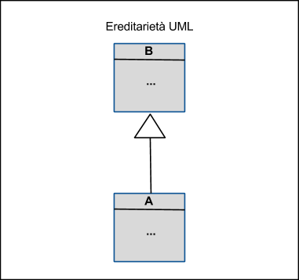

# Object Oriented Principles

Object oriented programming enable to abstract entity of the domain model into __objects__.

Objects are composed of two part: the __state__ and the __behaviour__. This two parts are implemented in a __class__. 

- __State__, the set of internal variables that define the characteristics at a certain time of execution;
- __"Behavior"__, the ways in which an object acts or reacts, in terms of how its state changes and how messages pass through.

Objects of a specific class are also called __instance__ of the __class__. 

The class is a blueprint of an object, characterized by __methods__ (behavior) and __attributes__ (state).

The difference between class and object are better explained in the snippet below:

```java
// This is the Class
public class Person {
	
	// This is the state of the object
	public String name, surname;
	
	// This is the constructor. It create new instance of person class
	public Person(String name, String surname){
		this.name = name;
		this.surname = surname;
	}

	//This is the behaviour
	public String getFullName(){
		return String.format("%s - %s", this.name, this.surname)
	}
}
// End of the class


// These are objects, or better instances, of Person
Person contributor = new Person("Didacus", "Abella");
Person creator = new Person("Dario", "Tecchia");
```

The interaction between different objects occurs through the exchange of messages (the sender object calls one of the methods "exposed" by the receiver object.) -> __Sequence Diagram__

Object Oriented Programming follow 3 important principles:
1. Encapsulation
2. Inheritance
3. Polymorphism

## Object Oriented Design
Object oriented design require a good knowledge of various techniques and best practices. For a developer point of view is a good idea to know the 21  __Design Patterns__ introduced by the Gof (Gang of Four). A pattern is solution to common problems encountered during development and are categorized into three main area:

1. __Creational Patterns__: Solve problems regarding object creation.
2. __Structural Patterns__: Solve problems regarding how to organize the interaction between objects.
3. __Behavioural Patterns__: Solve problems regarding runtime behaviour of the objects.

### Object Design vs Structured Design
- __Structured Approach__: Decomposition of algorithms into procedures.
- __OO Approach__: Interaction of elements that exchange messages with each other.

## OOP, OOD, OOA
- __Object Oriented Programming__: Implementation method in which programs are organized through a set of objects, each of which is an instance of a class, and these classes are all part of a hierarchy of entities joined together by an inheritance relationship.
- __Object Oriented Design__: Problem decomposition into objects: UML.
- __Object Oriented Analysis__: Analysis of a problem from the point of view of classes and objects.

## Object Oriented style features
Characteristics of the object oriented "style":
1. __Abstraction__: Allows you to focus attention on an external view of an object and not on implementation.
2. __Encapsulation__: The concepts of abstraction and encapsulation are complementary: abstraction focuses attention on the behavior and observable characteristics of an object, while encapsulation focuses on the implementation that succeeds in reproducing these characteristics.
4. __Modularity__: Program decomposition into components.

## Hierarchy
_`A` is a subclass of `B`_:



`A` inherits its behavior from `B`, and `A` can be used anywhere that `B` can be used.

## Polymorphism
There are three types of __polymorphism__:
- __Ad-Hoc Polymorphism__: method __overloading__.
```java
public double area(double base, double altezza) {
	return base * altezza * 0.5;
}
public double area(double x1, double y1,
                   double x2, double y2,
                   double x3, double y3) {
	return 0.5 * (x1*y2 + y1*x3 + x2*y3 - x3*y2 - y3*x1 - x2*y1);
}
```
- __Inclusion Polymorphism__: method __override__ (except private or final methods).
```java
public class B {
	public int method(int i, int j) {
		return i+j;
    }
	public final int finalMethod(int i, int j) {
		return i+j;
	}
}
public class A extends B {
	public int method(int i, int j) {
		return i-j;
	}
	
	/*
	 * finalMethod can't be overrided because its modifier is final 
	 *
	 public int finalMethod(int i, int j) {
	 	 return i-j;
	 }
	 */
}
```
- __Covariant Return Type__: a method whose return value can be replaced with a subtype when a method is overridden in a subclass.
```java
public class D {
	public B giveMeB() {
		// ...
	}
}
public class E extends D {
   public A giveMeB() {
     // returns A instance
   }
}
```