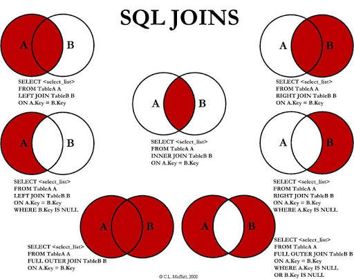

# SQL

## Key Types
- `PRIMARY KEY`: The `PRIMARY KEY` constraint uniquely identifies each record in a table. It must contain UNIQUE values, and cannot contain `NULL` values.
- `UNIQUE`: The `UNIQUE` constraint ensures that all values in a column are different, and can contain `NULL` values.
- `COLUMN INDEX`: Indexes are used to retrieve data from the database more quickly than otherwise. The users cannot see the indexes, they are just used to speed up searches/queries.
- `FULLTEXT`: Used to speed up searches inside text fields.
- `FOREIGN KEY`: The `FOREIGN KEY` constraint is used to prevent actions that would destroy links between tables. A `FOREIGN KEY` is a field (or collection of fields) in one table, that refers to the `PRIMARY KEY` in another table.

> Note: Updating a table with indexes takes more time than updating a table without (because the indexes also need an update). So, only create indexes on columns that will be frequently searched against.

### Referential integrity of mysql foreign keys rules
1. Each element in the secondary table must correspond to an element in the primary table.
2. In case of deletion or modification of data in the primary table there must be a corresponding action in the secondary table.

## JOIN
A `JOIN` clause is used to combine rows from two or more tables, based on a related column between them.

Here are the different types of the JOINs in SQL:
- `(INNER) JOIN`: Returns records that have matching values in both tables.
- `LEFT (OUTER) JOIN`: Returns all records from the left table, and the matched records from the right table.
- `RIGHT (OUTER) JOIN`: Returns all records from the right table, and the matched records from the left table.
- `FULL (OUTER) JOIN`: Returns all records when there is a match in either left or right table.

