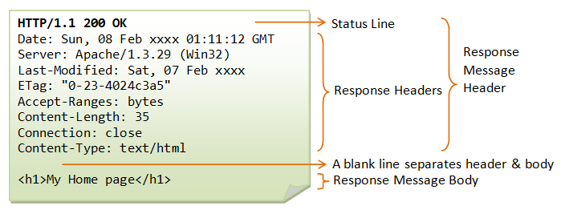

# Internet

## What is Internet?

Internet is telecomunication system that connects computers to different parts of the world. The computers (__nodes__) are connected in a net and all the aspects regarding its functionalities are defined in the __TCP__ protocol suite. This protocol is a semplification of the standard __ISO/OSI__ dividing the model into 5 main parts:

1. Application Layer
2. Transport Layer
3. Internet Layer
4. Link Layer

### Application Layer

This layer define protocols utilized by applications (browsers, email client, download managers) used by the end users. Here are defined protocols as:

- HTTP/S
- DHCP
- FTP
- Telnet
- POP3

### Transport Layer

Here the data sent from the application layer are transformed into __packets__ and handle possible tramsmission errors. Here two protocols are defined:

- TCP
- UDP

### Internet Layer

The packets are sent to their own destination by routing the packets with specific algoritms. Here are used the IP addresses to identify the destination node.

### Link Layer

Trasform the packets into signals and trasmitted to different trasmission mediums. These mediums can be:

1. Eletricals (Twisted Pairs)
2. Optical (Fiber)
3. Wireless

## HTTP

This is the most used protocols and stands for Hypertext Transfer Protocol. Its a __stateless__ protocol used in client-server architecture. The communication follow these schema:

1. A cliet send a __Request__ to a server.
2. The server process the request and send a __Response__

